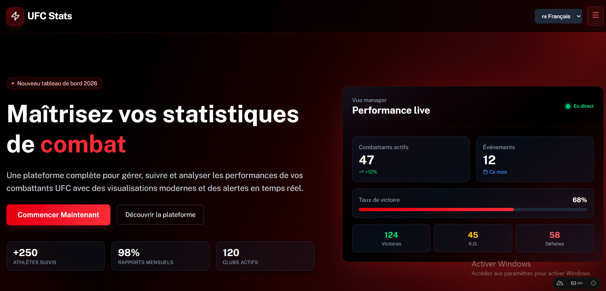

# UFC Stats - Application de gestion de combattants

Application moderne de gestion et de suivi des statistiques de combattants UFC, développée avec Nuxt 4, Vue 3 et TypeScript.



## 🚀 Fonctionnalités

- 📊 Tableau de bord avec statistiques en temps réel
- 🥊 Gestion complète des combattants (CRUD)
- ⭐ Système de favoris persistant
- 🔄 Comparaison d'athlètes (jusqu'à 2)
- 🔍 Recherche et filtres avancés
- 📱 Design responsive et moderne
- 🎨 Interface utilisateur avec Tailwind CSS
- 💾 Persistance des données avec localStorage

## 🛠️ Technologies utilisées

- **Framework**: [Nuxt 4](https://nuxt.com/)
- **UI**: [Nuxt UI](https://ui.nuxt.com/) & [Tailwind CSS](https://tailwindcss.com/)
- **State Management**: [Pinia](https://pinia.vuejs.org/)
- **Language**: [TypeScript](https://www.typescriptlang.org/)
- **Icons**: [Lucide Icons](https://lucide.dev/)
- **Package Manager**: [pnpm](https://pnpm.io/)

## 📦 Installation

```bash
# Cloner le repository
git clone https://github.com/amadoudiop04/webfrontavancefilerouge-vue.git

# Installer les dépendances
pnpm install

# Lancer le serveur de développement
pnpm dev
```

Le serveur sera accessible sur `http://localhost:3000`

## 🏗️ Structure du projet

```
webfrontavance-vue/
├── app/
│   ├── components/        # Composants Vue réutilisables
│   │   ├── ui/           # Composants UI de base
│   │   └── ...           # Composants métier
│   ├── pages/            # Pages de l'application
│   ├── stores/           # Stores Pinia pour la gestion d'état
│   ├── assets/           # Assets statiques (CSS, images)
│   └── utils/            # Fonctions utilitaires
├── composables/          # Composables Vue réutilisables
├── plugins/              # Plugins Nuxt
├── types/                # Déclarations de types TypeScript
└── nuxt.config.ts        # Configuration Nuxt
```

## 📜 Scripts disponibles

```bash
# Développement
pnpm dev              # Démarrer le serveur de développement

# Production
pnpm build            # Build de production
pnpm preview          # Preview du build de production

# Qualité de code
pnpm lint             # Linter le code
pnpm typecheck        # Vérifier les types TypeScript

# Autres
pnpm postinstall      # Préparer Nuxt après installation
```

## Notez bien 
```
Pour tester les fonctionnalités du mode administrateur, assure-toi d’accéder au fichier auth.js dans le dossier store, puis de modifier la valeur de la variable isAdmin en la passant à true.

→ isAdmin: true
```

 ## Retrouvez moi sur linkedin
 https://www.linkedin.com/in/amadou-diop-3a5258316/