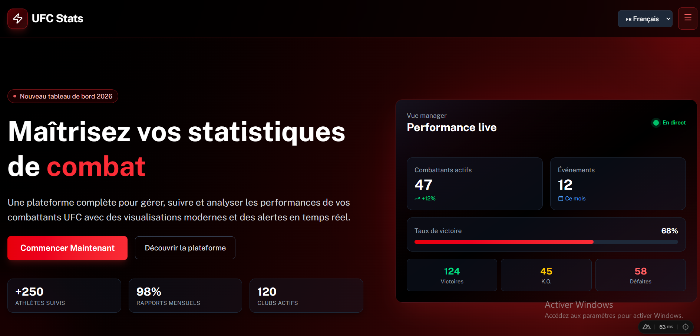

# 🥊 UFC Stats Manager

> **Plateforme complète de gestion et d'analyse des statistiques de combattants UFC**

Une application web moderne conçue pour gérer, suivre et analyser les performances de vos combattants UFC avec des visualisations avancées et une expérience utilisateur optimale.

---

## ✨ Fonctionnalités Principales

### 📊 Tableau de Bord Intuitif
- Statistiques en temps réel de vos combattants
- Vue d'ensemble des performances globales
- Graphiques interactifs et indicateurs clés (KPI)
- Indicateurs de tendances (↑ ↓)

### 🥊 Gestion Complète des Combattants
- **CRUD Complet** : Créer, lire, modifier, supprimer des combattants
- **Profils Détaillés** : Nom, surnom, palmarès, statistiques
- **Classification** : Catégories de poids, classement UFC
- **Suivi d'État** : Actif, blessé, retraité, en pause

### ⭐ Système de Favoris
- Marquer vos combattants préférés
- Accès rapide à vos favoris

### 🔄 Comparaison d'Athlètes
- Comparer jusqu'à 2 combattants côte à côte
- Analyse comparative des statistiques

### 🔍 Recherche et Filtrage Avancés
- Recherche par nom / surnom
- Filtrage par catégorie de poids
- Filtrage par pays d'origine
- Filtrage par statut

### 🌍 Support Multilingue (i18n)
- **Français** (Défaut) 🇫🇷
- **Anglais** 🇺🇸
- Changement de langue instantané

### 📱 Design Responsive & Moderne
- Adaptable à tous les appareils

## 🛠️ Stack Technique

| Technologie | Utilisation |
|-------------|-------------|
| **Nuxt 4.3.0** | Framework Vue fullstack |
| **Vue 3.5.27** | Framework UI réactif |
| **TypeScript** | Typage statique |
| **Tailwind CSS** | Styling utilitaire |
| **Pinia** | Gestion d'état centralisée |
| **Vue i18n** | Internationalisation multilingue |
| **Lucide Icons** | Iconographie moderne |

---

## 🚀 Démarrage Rapide

### Prérequis
- **Node.js** ≥ 18.0.0
- **pnpm** ≥ 8.0.0

### Installation

\\\bash
# 1️⃣ Cloner le repository
git clone https://github.com/amadoudiop04/webfrontavancefilerouge-vue.git
cd webfrontavancefilerouge-vue

# 2️⃣ Installer les dépendances
pnpm install

# 3️⃣ Lancer le serveur de développement
pnpm dev
\\\

✅ Accédez à **http://localhost:3000**

---

## 📜 Scripts NPM

\\\bash
pnpm dev              # Démarrer le serveur de développement
pnpm build            # Build de production
pnpm preview          # Prévisualiser le build
\\\

---

## 👨‍💼 Mode Administrateur

Pour tester les fonctionnalités admin :

1. Ouvrez \app/stores/auth.ts\
2. Changez \isAdmin: false\ → \isAdmin: true\

---

## 🐛 Dépannage

### Les traductions ne s'affichent pas
- Vérifiez les fichiers \locales/fr.json\ et \locales/en.json\
- Redémarrez le serveur : \pnpm dev\
- Videz le cache du navigateur

### Le serveur ne démarre pas
\\\bash
rm -rf .nuxt
pnpm install
pnpm dev
\\\

---

## 📚 Documentation

- 📖 [Nuxt Docs](https://nuxt.com/docs)
- 🎨 [Tailwind CSS](https://tailwindcss.com/)
- 🏪 [Pinia](https://pinia.vuejs.org/)
- 🌍 [Vue i18n](https://vue-i18n.intlify.dev/)

---

## 👨‍💻 Auteur

**Amadou Diop**

- 💼 [LinkedIn](https://www.linkedin.com/in/amadou-diop-3a5258316/)
- 🐙 [GitHub](https://github.com/amadoudiop04)